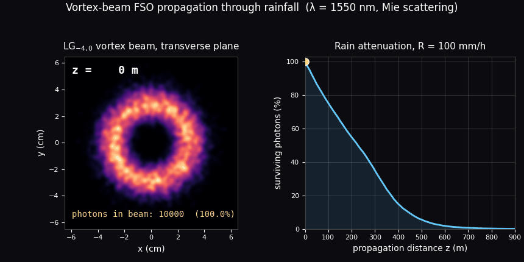

# 🌧️ Vortex-Rain-FSO

## 👥 Authors

- **Yuichi Isashi** — School of Electrical and Computer Engineering, University of Oklahoma; Center for Quantum Research and Technology, University of Oklahoma
- **Yaser M. Banad** — School of Electrical and Computer Engineering, University of Oklahoma
- **Sarah S. Sharif** — School of Electrical and Computer Engineering, University of Oklahoma; Center for Quantum Research and Technology, University of Oklahoma  
  *Corresponding author: s.sh@ou.edu*

## 📌 Repository Description

This repository contains MATLAB simulation and analysis codes for physics-based modeling of Laguerre-Gaussian vortex beam propagation in rainy free-space optical communication channels. The framework compares Geometrical Optics and Mie scattering models across rain rates, propagation distances, wavelengths, droplet sizes, and LG beam modes to estimate received photon count, signal-to-noise ratio, and attenuation behavior.

## 🧾 Abstract

Free-space optical (FSO) communication links using Laguerre-Gaussian (LG) beams are sensitive to rain-induced scattering, attenuation, and phase distortion. This codebase supports a Monte Carlo photon-tracing framework for analyzing structured-light propagation through simulated rainfall environments using both Geometrical Optics (GO) and Mie scattering. The simulations evaluate received photon counts, signal-to-noise ratio (SNR), attenuation trends, and mode-dependent performance under adverse weather conditions, providing quantitative guidance for resilient optical wireless links.

## 🔬 Scientific Scope

The repository supports simulations and post-processing for:

- LG beam propagation through randomized rainfall fields.
- Comparison of Geometrical Optics and Mie scattering models.
- Photon-count and SNR evaluation as functions of propagation distance.
- Rainfall-rate-dependent attenuation analysis.
- LG mode comparison, including individual and superposed modes.
- Figure generation for manuscript-quality plots.



## 📁 Repository Structure

```text
vortex-rain-fso/
├── README.md
├── LICENSE
├── CITATION.cff
├── .gitignore
├── run_all_simulations.m
├── simulate_GO_with_model.m
├── simulate_Mie_with_model.m
├── Fig_Extract_data.m
├── Fig_RainfallModel.m
├── Fig_single_vs_average.m
├── Fig_vsMode.m
├── Fig_vsRainfall.m
├── data/
│   └── README.md
└── docs/
    └── repository_description.md
```

## 🧮 MATLAB Files

| File | Purpose |
|---|---|
| `run_all_simulations.m` | Batch driver for rainfall propagation simulations. |
| `simulate_GO_with_model.m` | Photon-tracing simulation using the Geometrical Optics scattering model. |
| `simulate_Mie_with_model.m` | Photon-tracing simulation using precomputed Mie scattering data. |
| `Fig_Extract_data.m` | Extracts photon-count, noise-count, and SNR data from simulation outputs. |
| `Fig_RainfallModel.m` | Visualizes representative raindrop-position models. |
| `Fig_single_vs_average.m` | Compares single-run results with 10-run averaged results. |
| `Fig_vsMode.m` | Compares propagation results across LG modes. |
| `Fig_vsRainfall.m` | Compares propagation results across rainfall rates and extracts attenuation-law coefficients. |

## 📦 Required Data Files

Large `.mat` data files are not included by default. Before running the simulations, prepare the following folders/files in the repository root:

```text
Model of rainfall/
initialphoton/
mie_data_wavelength_1064.mat
mie_data_wavelength_1550.mat
```

Expected data variables include:

- `Model of rainfall/raindrop_positions_R_<rainfall>_z_<distance>_model_<model>.mat`  
  Required variable: `common_particle_positions`.
- `initialphoton/initial_photons<model>.mat`  
  Required variables: `initial_photon_positions`, `Phaseshift`.
- `mie_data_wavelength_<wavelength>.mat`  
  Required variables: `phi`, `theta`, `P`, `Phaseshift`.

See [`data/README.md`](data/README.md) for additional data-format notes.

## ▶️ How to Run

Open MATLAB in the repository root and add the folder to the MATLAB path:

```matlab
addpath(pwd)
```

Run the batch simulation driver:

```matlab
run_all_simulations
```

By default, the driver runs the Geometrical Optics simulation. To run the Mie scattering simulation, uncomment the Mie simulation line in `run_all_simulations.m`:

```matlab
simulate_Mie_with_model(R, r1, z, wavelength, modelPath, w0, segment_length, model_num);
```

After simulations are completed, extract processed data:

```matlab
Fig_Extract_data
```

Then generate the manuscript-style figures:

```matlab
Fig_RainfallModel
Fig_single_vs_average
Fig_vsMode
Fig_vsRainfall
```

## ⚠️ Important Notes Before Release

The provided GO simulation calls a helper routine named `scatterPhoton(...)`. Before making the repository public, add `scatterPhoton.m` to this repository or ensure it is clearly listed as an external dependency.

The analysis script `Fig_Extract_data.m` expects simulation-result folders with mode-specific names such as:

```text
GO_Simulation_Results LG00/
GO_Simulation_Results LG10/
GO_Simulation_Results LG-40/
GO_Simulation_Results LG10+LG-40/
Mie_Simulation_Results LG00/
...
```

If your simulation outputs are stored using different folder names, update the folder paths in `Fig_Extract_data.m` before running the extraction step.

## 📊 Outputs

The scripts generate MATLAB `.fig` files and image files in folders under:

```text
Results and Figures/
```

Typical outputs include:

- Received photon count versus propagation distance.
- SNR versus propagation distance.
- Comparison across rainfall rates.
- Comparison across LG modes.
- Single-simulation versus averaged-simulation plots.
- Attenuation-law coefficient and exponent trends.


## 📚 Citation

If you use this repository, please cite the associated manuscript:

> Y. Isashi, Y. M. Banad, and S. S. Sharif, “Hybrid Physics-Based Modeling of Vortex Beam Propagation for Free-Space Optical Communication in Rainy Atmospheres.”

A machine-readable citation template is provided in [`CITATION.cff`](CITATION.cff).

## 📜 License

This project is released under the **MIT License**. See [`LICENSE`](LICENSE) for details.
